# VSCode 편리한 기능들 정리

## 자동완성 

* 단어의 일부만 입력하면 나머지를 완성해주는 기능으로 JS에서 import하는 구문까지 알아서 입력해주기 때문에 편리하다.   

  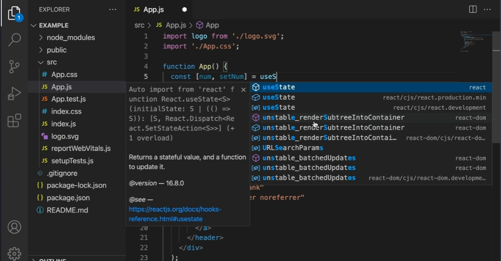
     
* 위의 사진처럼 코드의 일부를 입력시 다음과 같은 툴팁창이 나와 내가 입력한 내용을 바탕으로 완성할 내용을 추천해준다. (왼쪽에는 단어, 오른쪽에는 import 경로를 보여줌, 위의 맨 윗줄 예시를 보면 react 패키지를 import해준다는 것)   

* enter를 눌러주면 단어를 자동완성 시켜주며 import 구문까지 위에 작성되는 것을 확인할 수 있다.   

  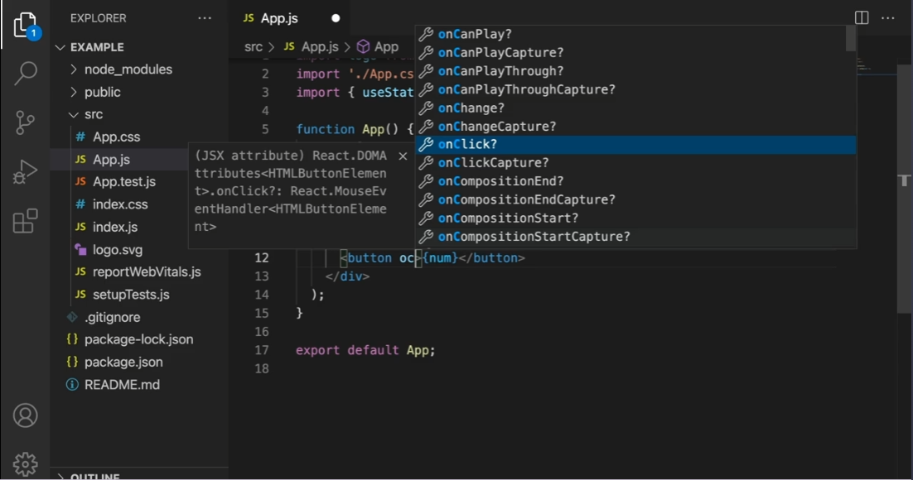

* 위와 같이 단어에 대문자가 있을 경우 앞글자를 기준(단어의 이니셜만 입력)으로 단어를 추천해주기도 함 (onClick 메서드를 이용하기 위해 oc를 타이핑하면 VSCode가 자동으로 추천해줌)

## 멀티커서 선택 

* 텍스트 커서를 여러개 만드는 것

* 변경하고 싶은 코드에 커서를 올려두고 'Ctrl + Shift + L'을 누르면 ( 맥os는 'Cmd + Shift + L') 현재 파일에 있는 같은 코드를 하이라이팅 해줘서 한번에 코드를 변경할 수 있다, 다시 텍스트 커서를 하나만 지정하려면 esc 누르면 됨.

* 'Ctrl + Shift + L' 대신 'Ctrl + D'를 2번 눌러서도 사용가능 , 바꾸고 싶은 코드의 아무 지점에 커서를 놓은 후 'Ctrl + D'를 한번 누르면 해당 코드만 하이라이팅되고 2번 누르면 해당 파일에 있는 모든 같은 코드 하이라이팅 시켜줌

  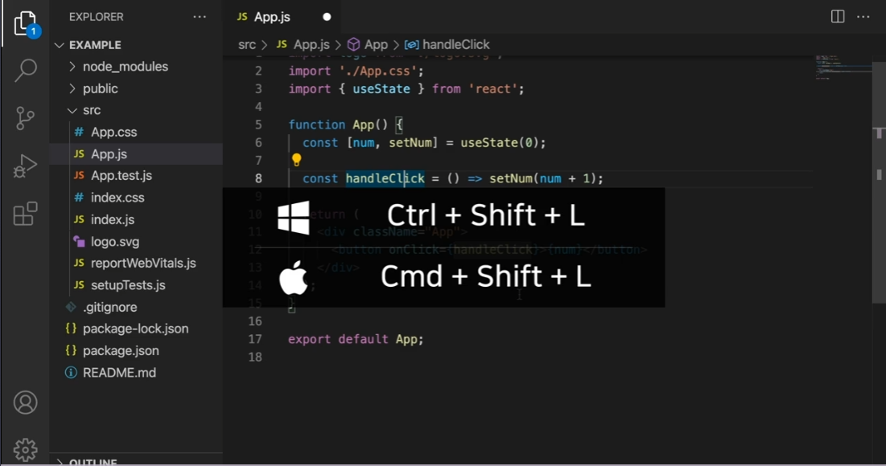

* 아래 코드와 같이 Alt키를 누른 상태에서 마우스로 커서를 원하는 코드에 클릭하면 사용자가 멀티커서를 직접 지정해서 사용할 수도 있다. (마찬가지로 커서를 다시 하나로 만들려면 esc 눌러주면 됨)

  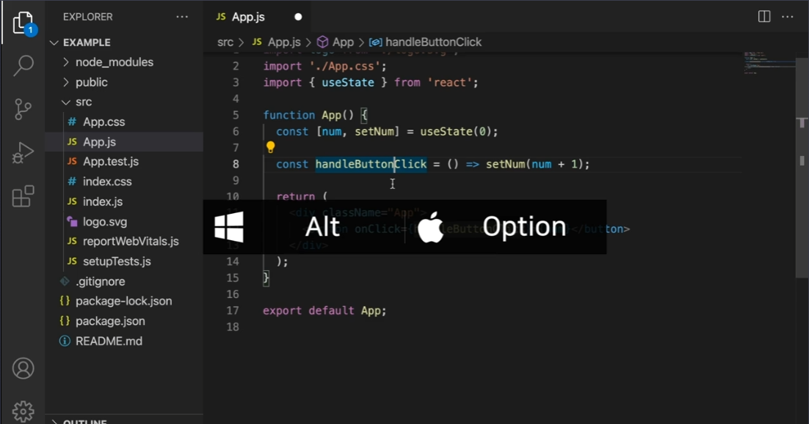

## 이름바꾸기 

* 변수 또는 함수가 사용된 곳을 찾아서 이름을 재지정해주는 기능.

   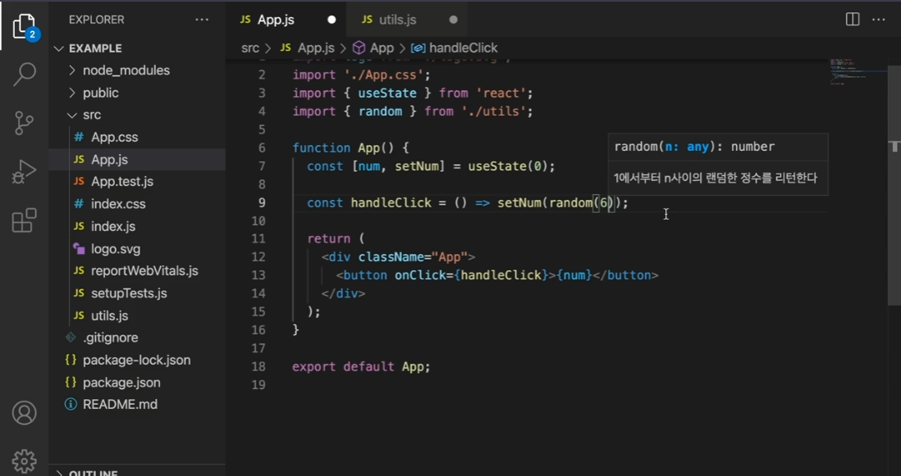

  위의 'App.js'코드는 'utils.js' 에서 import한 random()함수를 사용하고 있는데   

  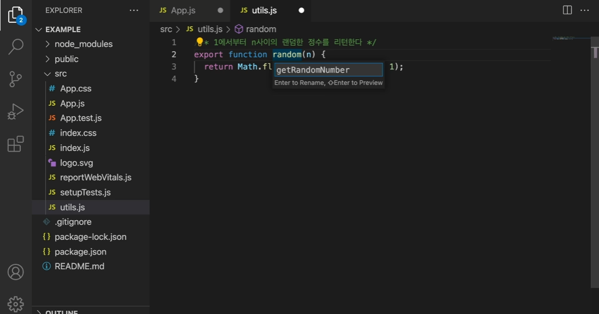
  
  위와 같이 'utils.js' 파일에서 random함수에 커서를 올린 후 F2키를 누르면 함수의 이름을 재지정할 수 있다.   

   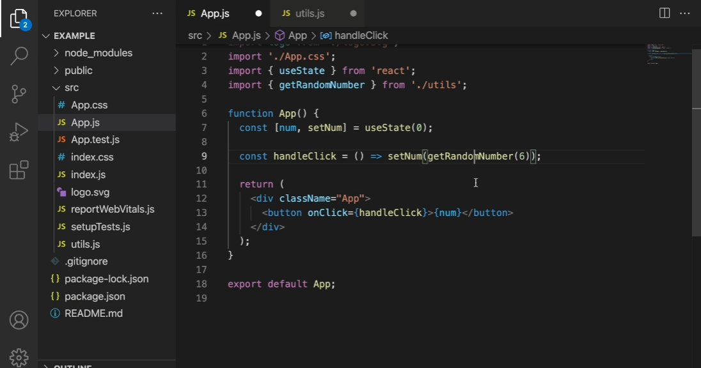
      
  이렇게 이름을 바꾼 후 위와 같이 다시 'App.js' 코드로 돌아오면 기존의 random 함수를 VSCode가 알아서 새로 지정된 getRandomNumber() 함수로 바꿔준 것을 확인할 수 있다.

## 해당 코드 파일로 이동

* 해당 코드가 적힌 파일로 편리하게 이동하는 기능 

  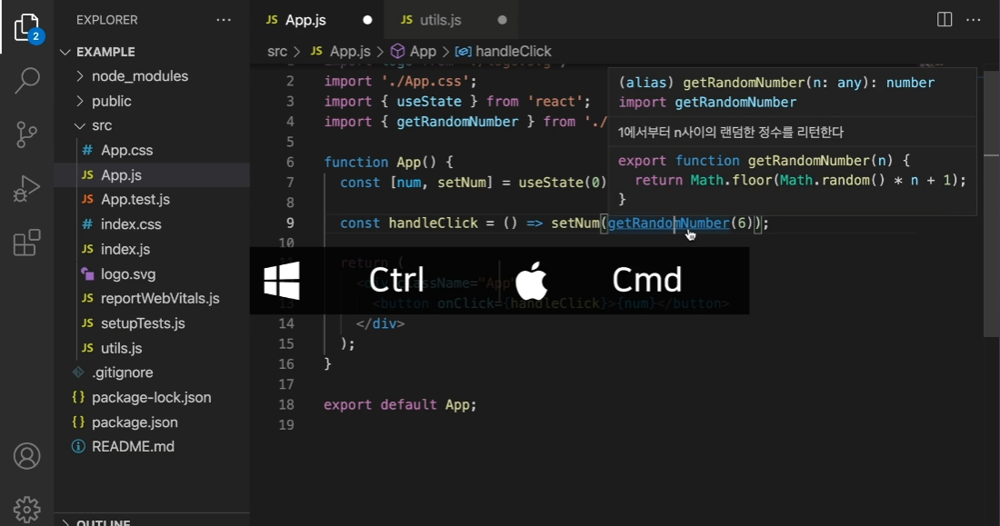

* 위와 같이 'Ctrl'키를 (맥os는 Cmd) 누른 상태로 위치를 알고 싶은 함수를 클릭하면 해당 코드에 밑줄이 생기며 링크처럼 변하게 되는데 클릭하게 되면 아래 사진처럼 해당 함수가 있는 파일인 'utils.js'로 바로 이동되는 것을 확인할 수 있다.
  
  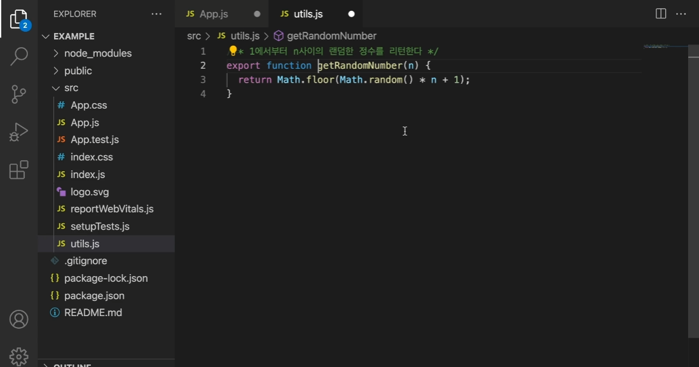

## 코드 줄 단위로 이동, 복제

* 'Alt + 위 혹은 아래 방향키' (맥os는 'Option + 위 혹은 아래 방향키') 를 누르면 현재 커서가 있는 줄의 코드를 위 또는 아래로 움직일 수 있다.

  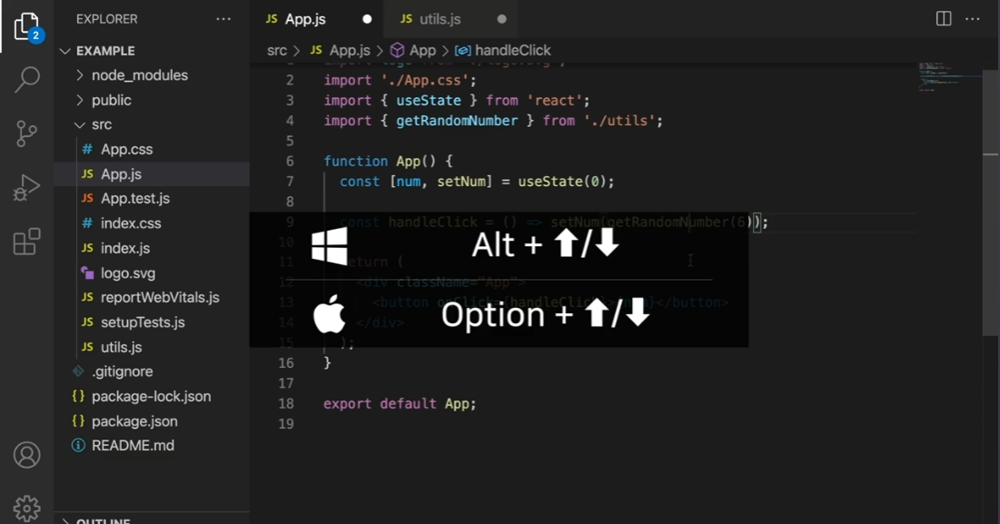

* 'Alt + Shift + 위 혹은 아래 방향키' (맥os는 'Option + Shift + 위 혹은 아래 방향키') 를 누르면 현재 커서가 있는 줄의 코드를 복제할 수 있다.

  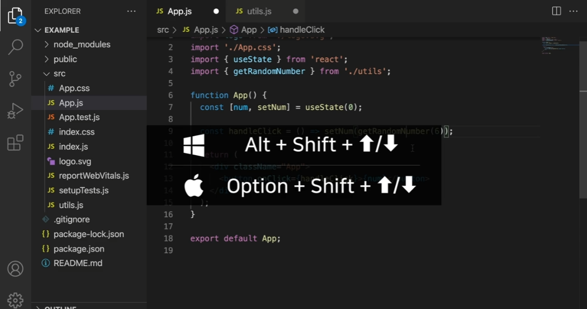

* 아래 사진은 위의 방법으로 코드 복제한 모습

  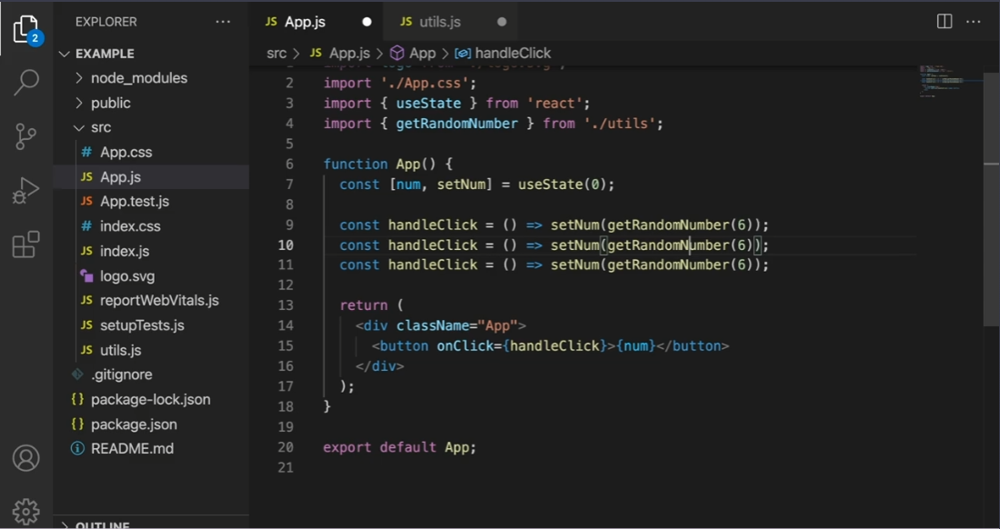

위의 단축키들은 VSCode의 메뉴에서 Help > Keybaord Shortcuts Reference 를 통해서도 확인이 가능하다.
